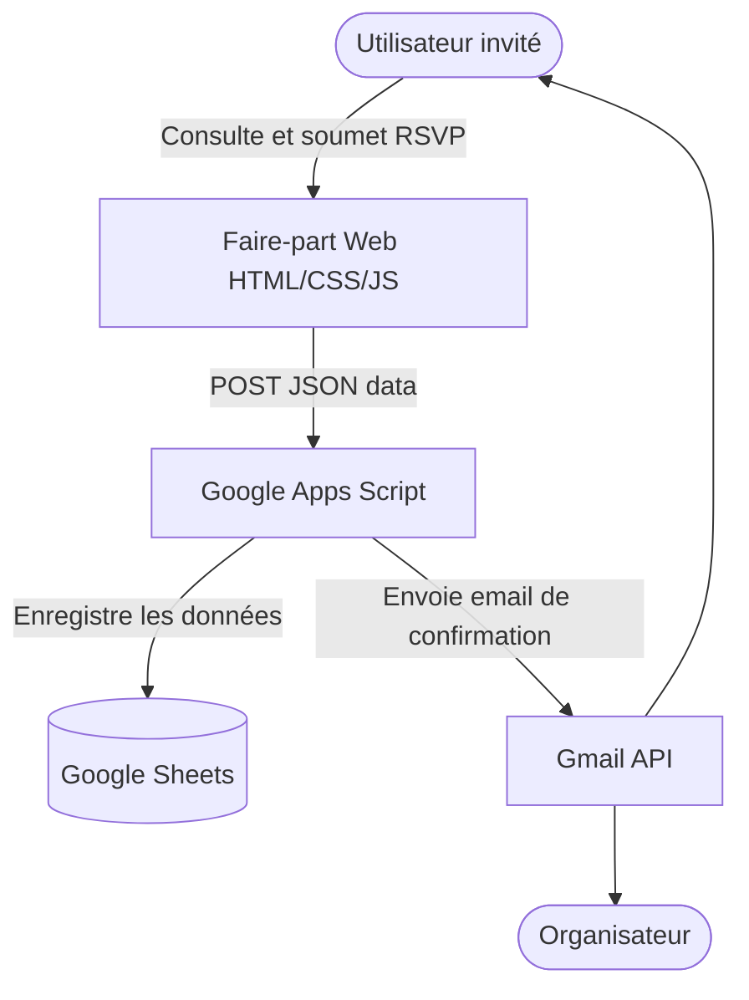

# 01. Architecture

Ce projet suit un modèle d'architecture **Static Site + Serverless API** (souvent appelé de type JAMstack minimaliste).

## Niveau 1 — Contexte Système

## Niveau 2 — Conteneurs

1.  **Frontend (Navigateur)** : Hébergé sur un serveur statique simple (GitHub Pages, Netlify, ou même un serveur Apache classique). Contient uniquement du HTML, CSS et JS vanilla.
2.  **Backend (Google Apps Script)** : Une application web déployée via Google Apps Script (fichier `Code.gs`) qui agit comme endpoint API, validateur de données, et gestionnaire d'emails.
3.  **Database (Google Sheets)** : Agit comme base de données principale. L'application écrit des lignes directement dans un onglet dédié ("RSVP Invités").

## Niveau 3 — Composants (Frontend)

*   **Cinématique d'Introduction** : Écran overlay (`div#introScreen`) contenant des portes (CSS animations) qui bloque l'application jusqu'à une interaction utilisateur.
*   **Hero / Landing** : Présentation éditoriale ("Quiet luxury").
*   **Module Itinéraire** : Intégration d'iframes Google Maps et boutons de redirection vers des itinéraires.
*   **Module Compte à Rebours** : Logique JavaScript (intervalle) mettant à jour des éléments DOM.
*   **Module RSVP** : Formulaire HTML natif capturant l'état (nom, email, présence) et effectuant une requête réseau.

## Couches architecturales

### Couche Présentation (HTML/CSS)
Définit la structure sémantique et gère **toutes** les animations visuelles complexes (portes, seal, fades, parallax) via CSS Transitions et Keyframes.

### Couche Interactions (JavaScript)
Agit comme un orchestrateur très léger. Il ajoute les écouteurs sur le sceau (pour déclencher les classes CSS qui ouvrent les portes), gère l'Intersection Observer pour les animations au scroll, calcule le compte à rebours, et intercepte la soumission du formulaire RSVP.

### Couche Réseau (JavaScript + GAS)
Le navigateur utilise l'API `fetch` avec le mode `no-cors`.
**Attention architecturale majeure:** Le `mode: 'no-cors'` implique que le frontend ne peut pas lire le corps de la réponse JSON renvoyée par Google Apps Script (la promesse résout une réponse opaque). La gestion des erreurs client-side est donc basée sur la réussite de la requête réseau elle-même, pas sur la validation métier du backend.

### Couche Logique Métier (GAS)
Validation des données, création dynamique des colonnes de Sheet, gestion des doublons (non gérés actuellement), calcul du nombre de personnes, génération d'emails HTML riches.
