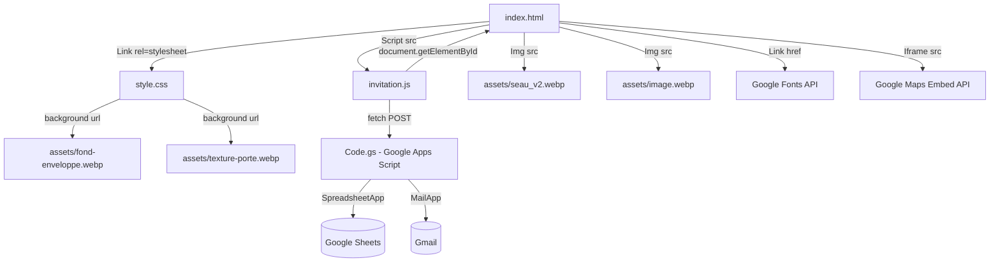

# 03. Dependency Graph

Ceci documente **comment chaque fichier mène à un autre**. Comme le projet n'utilise pas de bundler (type Webpack ou Vite), toutes les relations sont des références explicites HTML, CSS ou des appels réseau.

## Graphe des dépendances globales

## Table des Imports / Dépendances entre fichiers

| Source | Type de relation | Destination | Élément utilisé |
| :--- | :--- | :--- | :--- |
| `index.html` (L12) | `<link href>` | `https://fonts.googleapis.com/...` | Fonts: Cinzel, Cormorant Garamond, Montserrat, Great Vibes, Amiri |
| `index.html` (L15) | `<link href>` | `style.css` | Application du Design System |
| `index.html` (L24) | `` | `assets/seau_v2.webp` | Sceau d'introduction |
| `index.html` (L35) | `` | `assets/image.webp` | Basmala dans la section Hero |
| `index.html` (L111, L132) | `<iframe>` | Google Maps API | Cartes Mairie & Domaine |
| `index.html` (L213) | `<a href>` | `mariage.ics` | Fichier de calendrier (ATTENTION: le fichier *n'est pas présent* dans le repo) |
| `index.html` (L283) | `<script src>` | `invitation.js` | Logique d'animation et de formulaire |
| `style.css` (L113) | `url()` | `assets/texture-porte.webp` | Appliquée à `.door` |
| `style.css` (L208, L226, L239, L553) | `url()` | `assets/fond-enveloppe.webp` | Texture globale (`.main-content.revealed`, `.section::before`, `.hero-premium`, `.countdown-section::before`) |
| `invitation.js` (L2) | Constante URI | Google Apps Script URL | `https://script.google.com/.../exec` |
| `invitation.js` (L110) | `fetch()` | Google Apps Script URL | Soumission du payload RSVP |

### Dépendances CSS ↔ HTML ↔ JavaScript

Le couplage entre les couches HTML, CSS et JavaScript se fait via des ID uniques et des noms de classes spécifiques.

| Sélecteur / ID / classe | Défini dans | Stylé dans | Manipulé dans JS | Fonction / Effet |
| :--- | :--- | :--- | :--- | :--- |
| `#introScreen` | HTML (L20) | CSS (`.intro-screen`) | JS (L5, 11, 26, 42) | Container principal de l'introduction. Reçoit `.ready` puis `.open`, puis `display='none'`. |
| `#introBtn` | HTML (L24) | CSS (`.intro-seal`) | JS (L4, 16-22) | Le sceau cliquable. JS écoute le clic et altère `opacity` et `transform`. |
| `body.locked` | HTML (L18) | CSS (`body.locked`) | JS (L27) | Empêche le défilement initial (`overflow: hidden`). JS supprime la classe au clic. |
| `#mainContent` | HTML (L28) | CSS (`.main-content`) | JS (L6, 31) | Contenu de la page flouté/rétréci initialement. JS ajoute `.revealed`. |
| `.fade-in-up` | HTML (plusieurs) | N/A (Animé via CSS) | JS (L33-38, 149) | Éléments qui apparaissent au scroll. JS ajoute `.is-visible` via Intersection Observer. |
| `#countdown` | HTML (L156) | CSS (`.countdown-timer`) | JS (L162, 166) | Conteneur. JS remplace le HTML par "C'est le grand jour" à expiration. |
| `#days`, `#hours`, `#minutes`, `#seconds` | HTML (L157-160)| CSS (`.time-block span`) | JS (L175-183) | JS met à jour `innerText` à chaque intervalle. |
| `#rsvpForm` | HTML (L228) | CSS (`.rsvp-form`) | JS (L54, 82) | Formulaire écouté pour le `submit`. JS empêche l'action par défaut. |
| `input[name="attendance"]` | HTML (L237, 241) | CSS (`.radio-group input`) | JS (L58, 63, 76, 85) | JS écoute le changement (Oui/Non) pour afficher `#guestCountGroup`. |
| `#guestCountGroup` | HTML (L246) | CSS (N/A) | JS (L59, 66) | Container de la question "Nombre de personnes". Affiché/Caché par JS. |
| `#successMessage` | HTML (L265) | CSS (N/A) | JS (L55, 120-126) | Message de succès de formulaire. JS change le `display` et anime l'`opacity`. |
