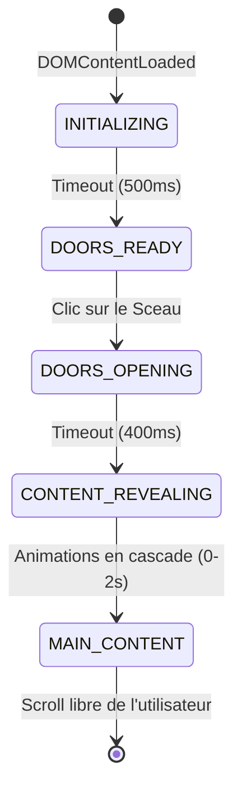
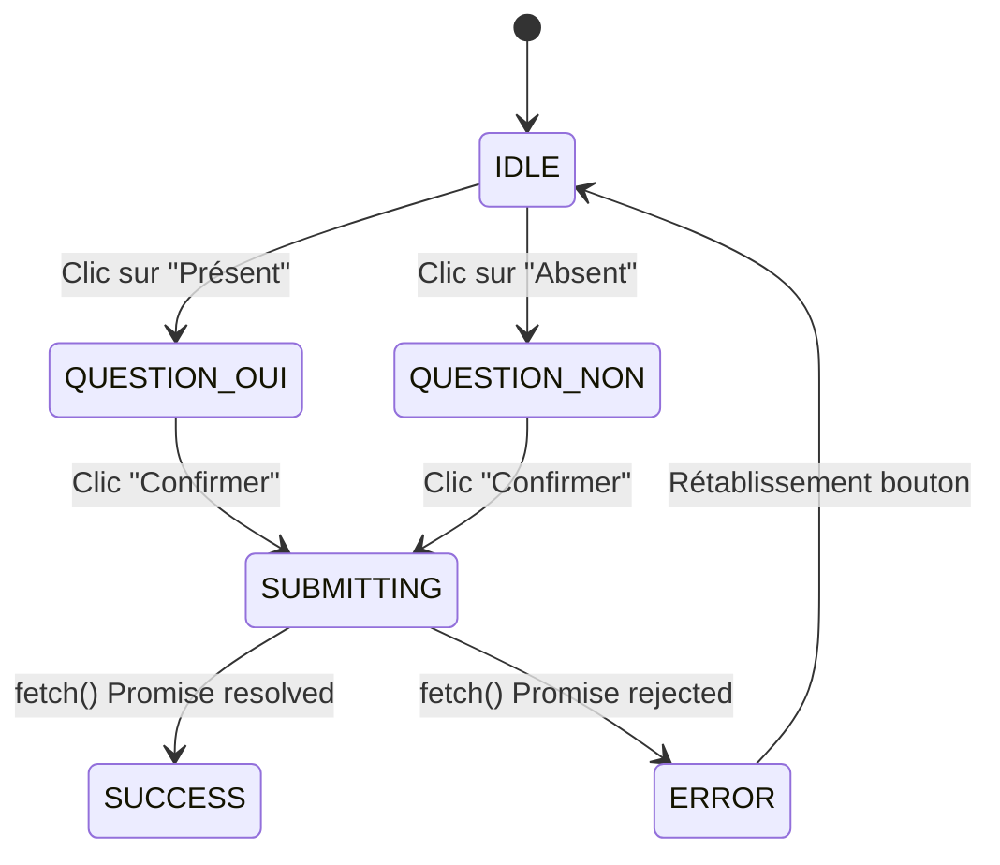

# 04. Cartographie des Routes & États

## Absence de routeur

> **Le projet n'utilise aucun routeur frontend.** (Pas de vue-router, react-router, pas de manipulations du History API).

Le projet est une véritable "Single Page" ancrée (SPA visuelle, pas architecturale).
Toute la navigation se fait via le scroll naturel de la page.

| Route (URL) | Type | Entrée | Destination |
| :--- | :--- | :--- | :--- |
| `/` (ou `index.html`) | Page d'accueil | Chargement initial | Écran d'Introduction (Portes) |
| `#histoire` | Ancre (ID) | Clic éventuel (bien qu'il n'y ait pas de menu de navigation actuel) | Section Duaa |
| `#parcours` | Ancre (ID) | Scroll | Section Programme / Maps |
| `#compte-a-rebours` | Ancre (ID) | Scroll | Section Date & Calendar |
| `#rsvp` | Ancre (ID) | Scroll | Formulaire RSVP |

## Machine à états (UI States)

Le site repose sur un flux séquentiel ("états" de l'interface gérés par les classes CSS manipulées par JS).

### State Machine Globale

| État Global | Déclencheur | Actions JS effectuées | CSS Classes Impactées |
| :--- | :--- | :--- | :--- |
| **INITIALIZING** | Chargement de la page | `window.scrollTo(0,0)` (bloque le scroll utilisateur s'il recharge) | `.locked` sur `body` |
| **DOORS_READY** | Délai de 500ms | Ajout classe au parent de la porte | `.intro-screen` gagne `.ready` |
| **DOORS_OPENING**| Clic sur `#introBtn` (Sceau) | Force scroll(0,0), Sceau disparait (`opacity=0`, `scale=1.2`) | `.intro-screen` gagne `.open`, `body` perd `.locked` |
| **CONTENT_REVEALING**| Délai 400ms après clic | Container principal s'anime | `#mainContent` gagne `.revealed` |

### État du Formulaire RSVP

| État Formulaire | UI visible | Bouton "Confirmer" |
| :--- | :--- | :--- |
| **IDLE** | Formulaire normal, champ "Nombre de personnes" caché. | Actif, texte original |
| **QUESTION_OUI** | Champ "Nombre de personnes" visible et requis. | Actif, texte original |
| **QUESTION_NON** | Champ "Nombre de personnes" caché et non requis. | Actif, texte original |
| **SUBMITTING** | Formulaire visible mais inactif. | Désactivé, texte: "ENVOI EN COURS..." |
| **SUCCESS** | Formulaire caché (fade out). | N/A |
| **ERROR** | `alert()` navigateur affichée. | Actif, texte original rétabli |
