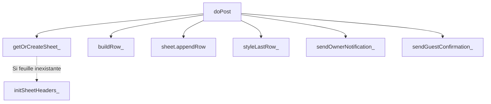

# 09. Backend (Google Apps Script)

Le fichier `Code.gs` sert de backend API et de contrôleur logique central pour la base de données (Google Sheets) et la messagerie (Gmail).

## Architecture du script

Le script est exécuté dans l'environnement serveur V8 de Google. Il expose deux points d'entrée :
1.  **`doGet(e)`** : Méthode de test retournant un texte brut `✅ RSVP Script actif`.
2.  **`doPost(e)`** : Endpoint principal recevant le payload JSON depuis le site web.

## Contrat Frontend ↔ Backend (Payload JSON)

| Champ | Type | Origine | Validation Front | Validation Back |
| :--- | :--- | :--- | :--- | :--- |
| `name` | String | `#name` | `required` (HTML) | Fallback à `''`, `trim()` |
| `email` | String | `#email` | `type="email"`, `required` | Fallback à `''`, `trim()`, `toLowerCase()` |
| `attendance` | String (`oui`\|`non`) | `input[name="attendance"]` | `required` (HTML + JS alert) | Vérifie `=== 'oui'` |
| `guests` | String | `#guests` | JS `required` si 'oui' | Ignoré si `attendance !== 'oui'` |
| `allergies` | String | `#allergies` | Aucune | Fallback `Aucune`, `trim()` |
| `message` | String | `#message` | Aucune | Fallback à `''`, `trim()` |

## Call Graph Backend

## Description des fonctions backend importantes

### `initSheetHeaders_(sheet)`
*   **Responsabilité:** Créer la structure de la base de données.
*   **Effet:** Ajoute la ligne d'en-tête (Date, Nom, Email, Présence, Nb. Personnes, Allergies, Message), fige la première ligne, ajuste la largeur des colonnes, et stylise l'en-tête (fond bordeaux `#5D262C`, texte clair).

### `sendOwnerNotification_(newRsvp, sheet)`
*   **Responsabilité:** Calculer les statistiques globales et envoyer l'email de notification.
*   **Logique:**
    1. Lit *toute* la base de données `getDataRange().getValues()`.
    2. Filtre les confirmés (`✅ Présent`) et les absents (`❌ Absent`).
    3. Calcule la somme de toutes les personnes `totalPers` (réduction du tableau).
    4. Génère des lignes HTML pour inclure la liste de tous les invités dans le mail.
    5. Appelle `MailApp.sendEmail()`.
*   **Sécurité:** Utilise une fonction utilitaire `esc_()` pour échapper les caractères HTML (`<`, `>`, `&`, `"`, `'`) avant injection dans le template de l'email pour éviter les injections XSS via le formulaire HTML.

### `sendGuestConfirmation_(data)`
*   **Responsabilité:** Envoyer l'email récapitulatif à l'invité.
*   **Logique:** Génère un template HTML spécifique selon si `attendance === 'oui'` (Récapitulatif des heures, lieux) ou `'non'` (Mot de remerciement court).

## Configuration Hardcodée

En début de fichier (`Code.gs` L18-25), le backend requiert une configuration stricte :

| Constante | Valeur actuelle | Description |
| :--- | :--- | :--- |
| `OWNER_EMAIL` | `soufiane.erd@gmail.com` | Email qui recevra les notifications. |
| `OWNER_NAME` | `Soufiane` | Nom de l'organisateur (utilisé dans les logs potentiels). |
| `SHEET_NAME` | `RSVP Invités` | Nom de l'onglet créé dans le Google Sheet actif. |
| `WEDDING_DATE` | `Vendredi 23 Octobre 2026` | Date injectée dans les emails. |
| `COUPLE` | `Soufiane & Salma` | Utilisé dans le titre des emails. |
| `RSVP_LIMIT` | `1er Septembre 2026` | Limite indicative. |
